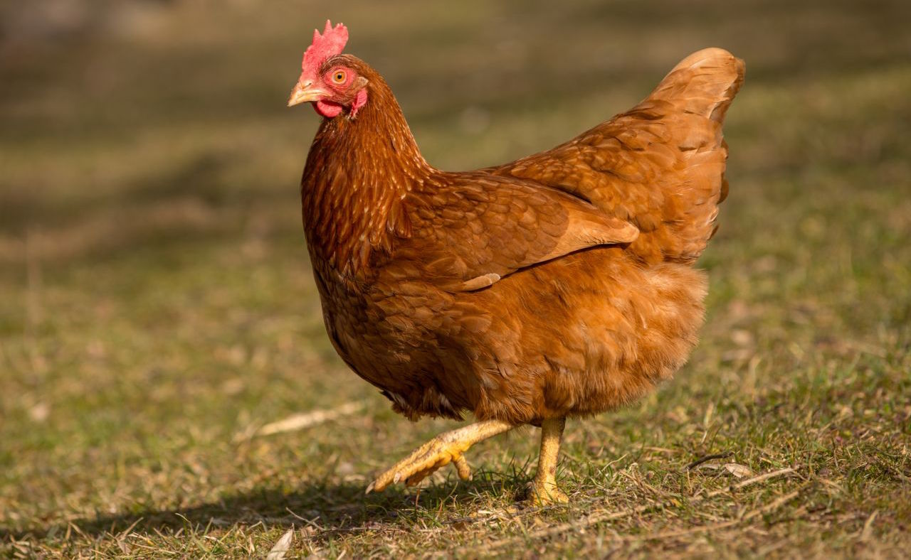

<!DOCTYPE html>
<html lang="tr">
<head>
  <meta charset="UTF-8">
  <title>Marmara İklimi</title>
  <link href="https://fonts.googleapis.com/css2?family=Playfair+Display:wght@700&family=Roboto:wght@400;500&display=swap" rel="stylesheet">
  
</head>
<body>

<header>Marmara İklimi</header>

<nav>
  <button class="active" onclick="show('iklim')">İklim Özellikleri</button>
  <button onclick="show('bitki')">Bitki Türleri</button>
  <button onclick="show('hayvan')">Hayvan Türleri</button>
  <button onclick="show('foto')">Fotoğraflar</button>
</nav>

  <section id="iklim" class="active">
    <h2>Genel Bakış</h2>
    
Marmara iklimi, Akdeniz ve Karadeniz iklimlerinin geçiş özelliklerini taşır. Yazları sıcak ve kurak, kışları ılık ve yağışlıdır. Kıyıdan iç kesimlere gidildikçe kara etki artar. İstanbul'da kentsel ısı adası etkisi gözlemlenir.

    

      

        <h4>20-28°C</h4>
        Yaz Sıcaklığı
      

      

        <h4>5-12°C</h4>
        Kış Sıcaklığı
      

      

        <h4>600-900 mm</h4>
        Yıllık Yağış
      

    

    <h3>Mevsimsel Dağılım</h3>
    
Yağışlar yıl boyunca dengeli dağılmıştır. Kış aylarında nispeten daha yoğundur; yazın kısa kurak dönemler görülebilir.

  </section>

  <section id="bitki">
    <h2>Bitki Türleri</h2>
    <h3>Ormanlar ve Makiler</h3>
    
Marmara’da meşe, kestane, kayın, ıhlamur gibi geniş yapraklı ormanlar ile maki (bodur çalı formasyonu) iç içe geçer.

    <h3>Tarım Ürünleri</h3>
    
Verimli topraklarda ayçiçeği, üzüm, buğday ve zeytin yetişir. Trakya ve Marmara kıyıları, ülkemizin önemli tarım alanlarıdır.

    

      
      
    

  </section>

  <section id="hayvan">
    <h2>Hayvan Türleri</h2>
    <h3>Orman ve Karasal Fauna</h3>
    
Yaban domuzu, tilki, sansar, porsuk gibi memeliler yaygındır. Orman altı faunasına sincap ve çeşitli küçük kemirgenler dahildir.

    <h3>Kıyı ve Sulak Alanlar</h3>
    
Boğaz’da yunuslar, martılar; deltalar ve göletlerde su kuşları (ördek, balıkçıl, leylek) görülür.

    

      
      
    

  </section>

  <section id="foto">
    <h2>Fotoğraflar</h2>
    

      
      
      
      
    

  </section>

</body>
</html>
